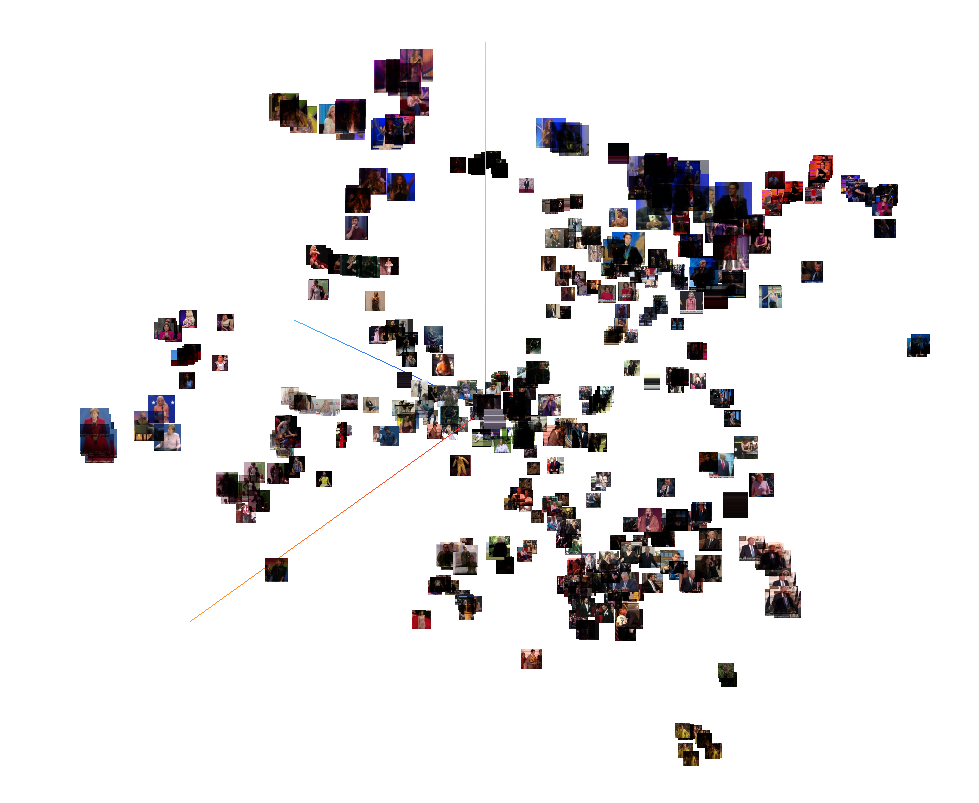

# Faceless recognition

Our brains use faces as the main classifier for a person’s identity. We even have a specific “face area” in the brain dedicated to this task. Computer vision tools are based on the same idea and use facial features for identifying people.
However, as humans, we can recognize close friends and others from afar and even from behind. This is achieved using other features such as hairstyle, body structure, gait, and other characteristics. Can we achieve the same using AI?

# Orcam's 2019 GreatMinds Challenge

We invite you to recognize celebrities based on sequences of low-resolution image-crops, which we grabbed and tagged from YouTube videos.
As we know you are limited on time and resources, you will also receive a set of features we prepared to help you focus on the algorithms.
Are you up to the challenge?

## Evaluation

Hackers will be scored in the following manner -
Top 5 predictions should be submitted for each sample video, in order of appearance.

```python
submission = [[best_index, second_best, ..., fifth_best],
              ...
              [best_index, second_best, ..., fifth_best]]
```

A correct index in the _ith_ index will add *100-10\*i* points to your score. So for example, hitting Top 1 will add 100 points to your score, while hitting 3rd will give you 80 points. Not including the correct index in the Top-5 list will not reward points. See the Solution Example to see how to wasily create a submission based on a similarity matrix.
You can submit to the scoring-server by calling:

```python
from evaluate import submit
submit('Team Name', submission)
```

If you get a reply with a score of -1, it means something is wrong with your submission. Check the submission's shape matches the number of unique test sequences. Come see us if you need any help.

## Rules

You are welcome to use any additional data and open-source libraries as you please. As well as manually tagging the data we provided here.

## Data download links

You can download the data from:

```
https://datahack-2019.s3-eu-west-1.amazonaws.com/images.tar
https://datahack-2019.s3-eu-west-1.amazonaws.com/pose.pkl
https://datahack-2019.s3-eu-west-1.amazonaws.com/signatures.pkl
https://datahack-2019.s3-eu-west-1.amazonaws.com/images_test.tar
https://datahack-2019.s3-eu-west-1.amazonaws.com/pose_test.pkl
https://datahack-2019.s3-eu-west-1.amazonaws.com/signatures_test.pkl
```

Copy the data to the "GreatMinds2019/data/..." to be able to run the example solutions.

## The training data

### [images.tar](https://datahack-2019.s3-eu-west-1.amazonaws.com/images.tar)

A tar file with all the image sequences. Files are divided by identity, video, and sequence as follows:

```
person_0000/video_0000/seq_0000/frame_0000.jpg
person_0000/video_0000/seq_0000/frame_0001.jpg
...
```

Tar files are pretty sluggish to work with, so we wrote the [Images](data.py#L8) class to make it easier for you to use this data without having to untar it. Here's an example:

```python
from data import Images
with Images('data/images.tar') as images:
    path = images.paths[0]
    image = images[path]
    print 'read image "{}"" of shape {}'.format(path, image.shape)
# read image "person_0013/channel_0081/seq_0009/frame_00425.jpg"" of shape (64, 64, 3)
```

### [pose.pkl](https://datahack-2019.s3-eu-west-1.amazonaws.com/pose.pkl)

A pickle file with 17 pose keypoints detected for each frame along with the detection scores. As w rule of thumb, you should filter out points with score 0 or below.

```python
from data import read_pose
paths, keypoints, scores = read_pose('data/pose.pkl')
```

The pose points are ordered similarly to the data in the [MS COCO Keypoint detection challenge](http://cocodataset.org/#keypoints-2019):

```python
["nose", "left_eye", "right_eye", "left_ear", "right_ear", "left_shoulder",
 "right_shoulder", "left_elbow", "right_elbow", "left_wrist", "right_wrist",
 "left_hip", "right_hip", "left_knee","right_knee", "left_ankle" "right_ankle"]
```

### [signatures.pkl](https://datahack-2019.s3-eu-west-1.amazonaws.com/signatures.pkl)

A pickle with a sampled set of imagenet signatures computed over the crops. The reason we are providing only a sample of the evaluations is that the full set of signatures will take up about X4 of the original images file.

```python
from data import read_signatures
paths, signatures = read_signatures('data/signatures.pkl')
```

See our data visualization and solution demos to see an example of how to use this data. When you use these features make sure to use the "paths" to synchronize it with the rest of the data.

## The evaluation data

Evaluation data is similar to the train data, except we removed the person and video numbers from the paths. So evaluation paths look like this:

```
seq_0000/frame_0000.jpg
seq_0000/frame_0001.jpg
...
```

## Data Visualization

In this demo, use the [Tensorboard Embedding Projector](https://www.tensorflow.org/guide/embedding) to visualize our data, embedded based on the pre-computed imagenet signatures.
To run the visualization simply call [visualization.py](visualization.py) from the directory the data was saved to. Once complete you should see the following lines:

```bash
# Visualization ready
# run:      tensorboard --logdir=runs
```

Then simply start a tensorboard server by calling

```bash
tensorboard --logdir=runs
# TensorBoard 1.14.0 at http://localhost:6006/ (Press CTRL+C to quit)
```

Using T-SNE for projecting the data to a 3d should look something like this:

As you progress with your solution you can expect the clusters to become better separated and clearer.

## Solution Demo

For a naive solution, we will use only the provided imagenet signatures and use a very straight-forward approach.
First, we split the data 50-50 into train and evaluation. So for each person, half the **videos** will be used for training, and the rest for evaluation.

```python
# Enumerate the frame paths based on person and video
person_ids, video_ids = enumerate_paths(paths)
# For each person, split his set of videos to train and test
train_indices, test_indices = train_test_split(person_ids, video_ids,
                                               train_to_test_ratio)
```

We then average all the training signatures of each person, and concatenate these together, making our (training free!) classification matrix.

```python
# Find the mean signature for each person based on the training set
train_sigs = split_by(signatures[train_indices], person_ids[train_indices])
train_sigs = np.vstack([np.mean(ts, axis=0) for ts in train_sigs])
```

We do the same with the evaluation signatures, only this time we average the signatures per-video since we will need to make a prediction for each video.

```python
# Find the mean signature for each test - video and assign its ground-truth person id
test_sigs = split_by(signatures[test_indices], video_ids[test_indices])
test_sigs = np.vstack([np.mean(ts, axis=0) for ts in test_sigs])
# Ground truth labels
test_labels = np.array([pids[0] for pids in
                        split_by(person_ids[test_indices], video_ids[test_indices])])
```

Finally, we rank the best top-5 predictions from best to worst, based on the cosine similarity measure. Results are saved in a csv file and evaluated by calling 'evaluate.py'.

```python
# Predict classes using cosine similarity
similarity_matrix = cosine_similarity(test_sigs, train_sigs)
# Crate a submission - a sorted list of predictions, best match on the left.
ranking = similarity_matrix.argsort(axis=1)
submission = [line.tolist() for line in ranking[:, :-6:-1]]
# Compute and display top 1 / 5 accuracies
evaluate(submission, test_labels)
# top 1 accuracy 19.83%
# top 5 accuracy 46.55%
# mean score: 40.09
```

## Solution Demo With submit

Based on the same solution, we will soon make available a solution that uses the entire train data for learning identities, evaluates on the test data and submits the solution to the server.
Stay tuned!
